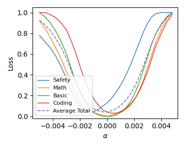

##  Too Long, Don't Read:  
在本篇博客中，我们将针对大模型Loss Landscape这一经典论文进行二次思考，提出多任务学习下存在的两种可能性：博弈智能与通用智能。通过一些简单且不严谨的数学讨论后将提出一种多任务协同智能的猜想，并且预言存在一种可靠的数据混合方法来强化预训练过程。

## 1.引言
一篇名为Unveiling the Basin-Like Loss Landscape in Large Language Models在2025年对LLM社区产生深刻的影响。

Huanran提出的LLM的损失山谷事实上是一种基于实验现象学的高度重要内容，在这里我们引用他的Blog并进行简单介绍与后文有关的部分内容，更细节的内容不做赘述。Blog:[大模型的Loss Landscape是什么样的？](https://zhuanlan.zhihu.com/p/1920616505151845374)

一个重要的视角为如果你对模型不同任务做Loss Landscape的话，你可以看到不同模型在不同任务之中形成了“山谷”的情况，即不同任务Loss最低的点处在相同的位置，并且不同任务的谷底长度也并不相同，但重要的是，它们在一个点的表征中出现了几乎相同的最佳。

  
  
<em>不同模型在不同任务上的损失景观，图片引用自Unveiling the Basin-Like Loss Landscape in Large Language Models</em>

这一有趣的现象在原论文中被用来指导预训练与后训练的安全微调等工作，这是一个十分富有Insight的有趣工作。实验设计与相关理论推导可见原论文内容，在这里我们不进行赘述，而是讨论一个更有趣的内容：“为什么LLM会出现山谷状的Loss landscape？”

**Trivial！** 我经常听到许多科研工作者在面对这个问题认为这是显而易见的，他们认为如果观察到了LLM山谷的现象是一个有趣且重要的现象，但为什么出现是微不足道的，这就是通往AGI的一条可靠路径：**模型在训练的过程中在所有任务取得最强**。然而，这正确吗？

一个不被注意到的现实是，如果这个观点是真的可靠的情况下，那么它将推翻我们之前对模型训练的所有范式。OK，让我们进入到一个原始且经典的观点论之中，当然在这里我们将出现不严谨的数学证明，不符合科研范式的数学假设以及没有过程的神秘猜测，如果你有更有趣的观点欢迎您对我的内容提出宝贵的意见与批评。

## 2.被遗忘的多任务学习
一个重要的观点是，LLM学到了一种通用语义表达即**模型对底层任务的逻辑推理等工作事实上对不同任务要求是通用的。** 事实上，这个观点可能过于乐观了，如果我们依靠这个逻辑，那么一个基于不同任务之间互相博弈的观点即将出现：**不同的任务表征能力应当是互相冲突的，他们选择的模型是一个恰好合理的点，而非一个同时的最优点。** 在这里作者定义为这是一种**博弈智能**。 *(注：其实这个观点来源于作者本人的主观臆断，一些其他的论文也有从贝叶斯与信息论等角度去解释为什么会出现损失景观，但作者本人对损失景观的出现的原因依然是感到怀疑且担忧的，并以此作为本文的主要论点)*

早期的多任务学习过程中经常出现不同任务之间互相博弈的情况，这也使得多任务学习中损失函数的标准化与参数化调整作为2018-2022年炼丹的重要环节，一些优化器也因此而被提出。但到了大模型，至少我们看到的Loss landscape并不够符合我们的核心观点，在作者本人使用十分钟编造数值后，他绘制出了一个自己幻想中的可靠图像：

  
  
<em>通过编造数据得到的虚拟图像，其中认为不同任务间不存在公共谷底，而是存在互相博弈的过程进一步在平均值最终取得的最优</em>

事实上这张图与真正的Loss Landscape不同之处在于，真实Loss Landscape存在一个公共的共同谷底，而本文作者的认知中，Loss应该不存在一个公共的共同谷底，存在一个真正的共同谷底的情况下，可能说明一个直观的想法，**它真的存在一个公共知识吗？**

**No!** 本文作者坚决反对这一观点，如果存在一个公共知识，那么我们在预训练过程中可以专注于单一任务与少量多任务语料训练，即可学到一个公共知识基底，只需要在后训练的微调之中引入更多任务即可。但事实上这并不是最优的训练策略，我们往往要在预训练之中引入不同的任务语料。在本文中将这种观点认为是**通用智能论**：即如果能在部分任务中表现良好，那么即可在后训练中不断推广。作为类比就是：如果一个人在数学上进行了充分的学习，那么他在后续的充分学习其他方向包括文学，计算机等任务依然会表现良好。从Loss landscape来看，这是一种从**博弈智能**通往**通用智能**的坚定证据。

## 3.作者对智能动力学的思考
通用智能是目前人类的一个可能存在的特性，但是在AI中并不存在，这是因为：**我们需要在预训练的过程中引入更多的任务类别，让模型早早的认知到不同模型！**那么一个过于主观的想法就是，在训练过程中，不同任务起到的训练性能并非基座模型，而是**减少**搜索空间的探索维度。

一个经典的动力学理论是，在不同的优化器下，相同的模型和数据会呈现出不同的动力学现象，以SGD与GD为例。存在一种在神经网络中迭代线性稳定性的观点，它需要满足：

GD的线性稳定性：$\lambda_{\max}((I-\eta H)^2)\le1$

SGD的线性稳定性：$\lambda_{\max}((I-\eta H)^2+\eta^2\frac{n-B}{B(n-1)}\Sigma)\le1$

其中$\eta$是学习率，$H$是海森矩阵。

一个显然的观点是，当GD线性稳定性时，SGD没有实现线性稳定性；而当SGD线性稳定性时，GD一定实现线性稳定性。*（观点引用自PKU的Lei Wu。是可解释性研究的前沿顶尖科学家，论文“How SGD Selects the Global Minima in
Over-parameterized Learning”）*

如果使用**本科**级别的数学知识，我们完全可以类比，目前的LLM学习中可能出现了一个简单的现象：当单个任务实现线性稳定性时，多任务学习没有实现线性稳定性；而当多任务学习实现线性稳定性。进一步采用十分暴力的不正确证明，我们可以给出一个不严谨的数学推导过程：

设多任务总损失为：
$$\mathcal L =\sum_{i=1}^m \alpha_i \mathcal L_i$$.
其中$\alpha_i$为权重。

那么使用二阶近似，可以对每个任务都近似为：
$$\mathcal L_i(\theta) \approx L_i(\theta^*)+\frac{1}{2}(\theta-\theta^*)^\top H_i(\theta-\theta^*)$$

那么$\delta(\epsilon)$最优邻域可以近似为：
$$\delta(\epsilon)=\{\theta: (\theta-\theta^*)^\top (\sum_i^m \alpha_i H_i)(\theta-\theta^*)\le 2\epsilon\}.$$ 

当$m$变大的情况下，这个近似区域的体积往往会变小。因为$H$的特征值在任务叠加的过程中在不断增大。这隐藏着一个有趣的过程，如果在求解过程中的求解路径过于崎岖，它反而更容易找到那个特殊的平坦解。*(值得注意的是，这个有趣的过程是绝对的猜测)*

那么通过这样的讨论，一个重要的观点是，增加多任务学习的语料来增加求解空间的崎岖性来降低待选择解的数量来提高模型的损失山谷的Bias。但是具体的预料混合策略在与训练的过程中并没有进行深入的思考与讨论，这一部分留给读者与我进行下一步思考。

## 4.作者的废话时间

这是我在主页攥写的第一篇Blog，里面充满了各种启发式思想与不严谨的数学证明，但是作为一个偏工程的数学研究者，我更倾向于现实之中的工程现象存在着可以用直觉解释的内容，但是这个直觉解释的过程必须十分深入的挖掘。当然，这篇Blog的质量并不高，只是抛砖引玉，如果有反对意见请尽情批评，如果您赞同我的观点，我不胜荣幸。